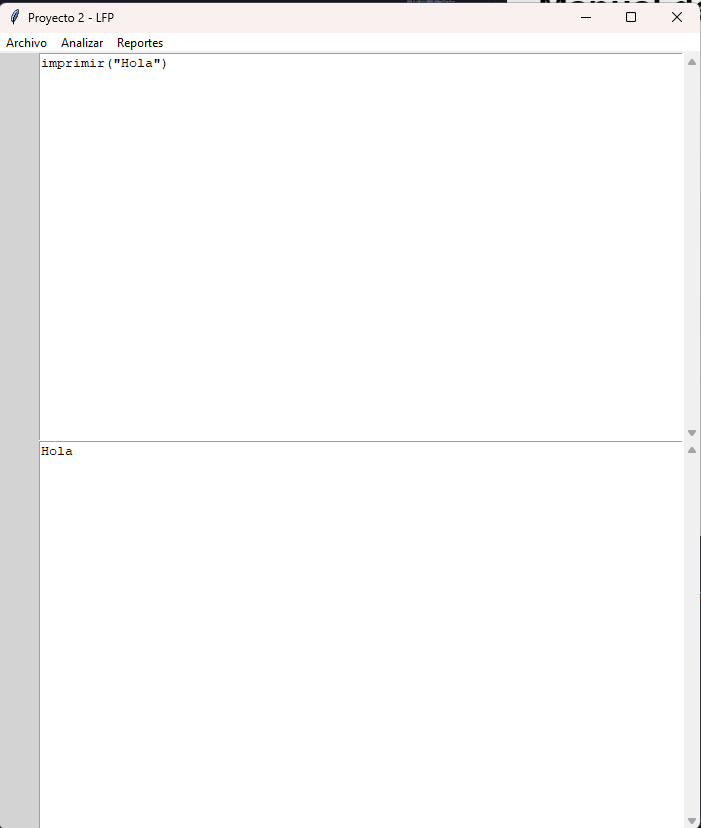
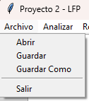
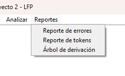
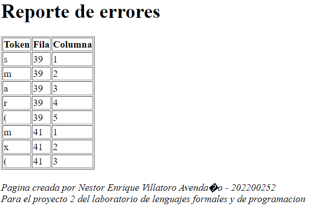
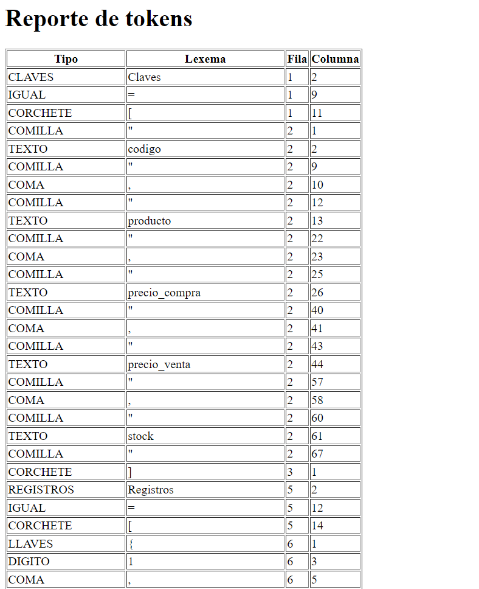
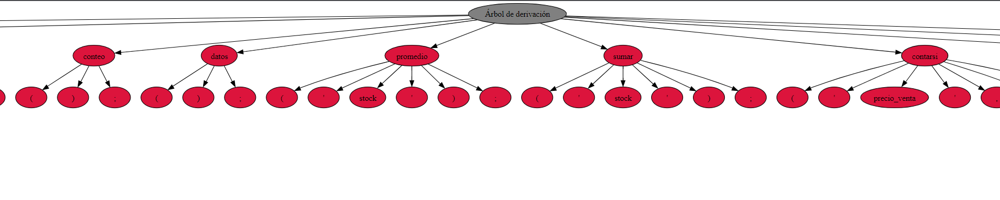

#Manual de usuario 
Ya en la interfaz del editor se puede escribir en el espacio de arriba mientras el lado de abajo solo puede mostrar texto.  

## Archivo
En la parte de arriba hay varios menús, el de archivo nos mostrará las opciones de abrir, guardar, guardar como y salir.  
* La opción de abrir nos permitirá seleccionar un archivo con la extensión .bizdata para mostrar su contenido en el editor. 
* La opción de guardar nos permitirá guardar los cambios en el archivo anteriormente abierto, en dado caso no se ha abierto ningún archivo, creará uno.  
* La opción de guardar como nos permitirá guardar un archivo nuevo. 
* La opción de salir cerrará el programa. 

## Analizar
El botón analizar sirve para analizar el código en el editor y mostrar en consola el resultado 
## Reportes

El menú de reportes nos da 3 opciones:  
* Reporte de errores generará un archivo .html con una tabla mostrando los errores léxicos y sintácticos, junto a la fila y columna donde se encuentran, del código. 

* Reporte de tokens generará un archivo .html con una tabla mostrando todos los tokens ingresados en el editor, junto a su tipo, fila y columna donde se encuentran. 

* Árbol de derivación generará un archivo .svg con la gráfica de los tokens de forma ordenada. 


### Comandos del editor:
```
imprimir("Hola");
imprimirln("hola");
Claves = [
"codigo", "producto", "precio_compra", "precio_venta", "stock"
]

Registros = [
{1, "Barbacoa", 10.50, 20.00, 6}
{2, "Salsa", 13.00, 16.00, 7}
{3, "Mayonesa", 15.00, 18.00, 8}
{4, "Mostaza", 14.00, 16.00, 4}
]
conteo();
datos();
promedio("stock");
sumar("stock");
contarsi("precio_venta", 16.00);
max("stock");
min("stock");
exportarReporte("Reporte_HTML_de_abarroteria");
'''
comentario multilinea
'''
```

