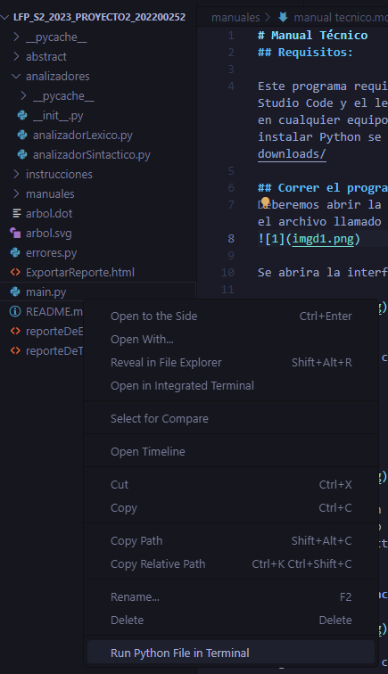
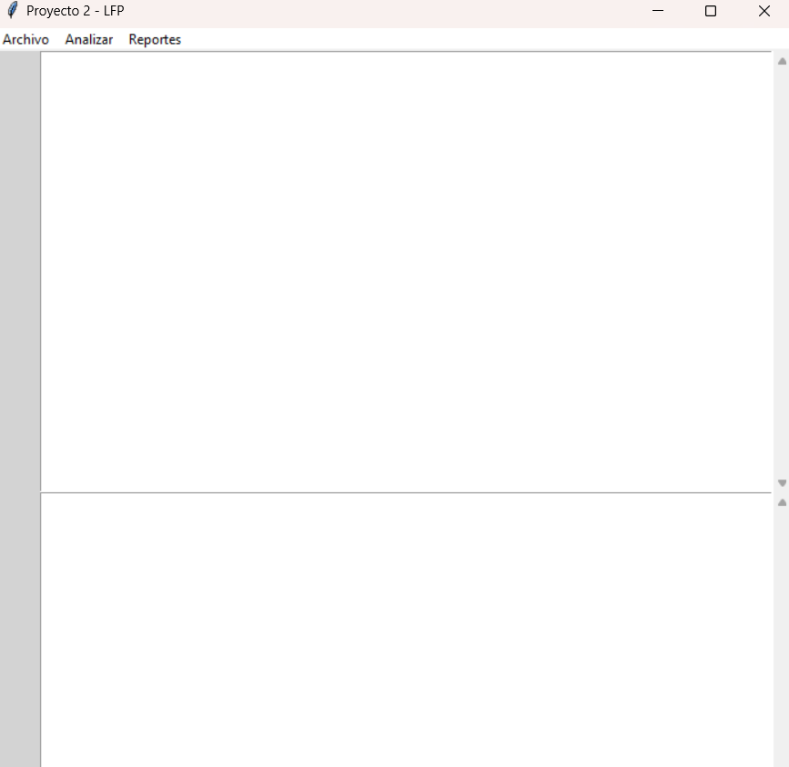

# Manual Técnico 
## Requisitos:

Este programa requiere tener instalados un editor de código fuente como Visual Studio Code y el lenguaje de programación Python. Este programa puede ser ejecutado en cualquier equipo que pueda tener los anteriores elementos mencionados. Para instalar Python se recomienda hacerlo desde su página https://www.python.org/downloads/

## Correr el programa
Deberemos abrir la carpeta en el editor de código fuente de preferencia y ejecutar el archivo llamado main.py

se abrirá el editor el cual se verá de la siguiente manera:


## Programa
El programa esta compuesto por los siguientes elementos principales:
* Abstract
* Analizadores
* Main
* Instrucciones
* Errores


### Abstract

En el abstract se hace la declaracion de clases abstractas y a su vez se declaran como "lexema" y "numero":
#### Clase abstracta
```
from abc import ABC, abstractmethod

class Expression(ABC):
    def __init__(self, fila, columna):
        self.fila = fila
        self.columna = columna

    @abstractmethod
    def operar(self, arbol):
        pass

    @abstractmethod
    def getFila(self):
        return self.fila

    @abstractmethod
    def getColumna(self):
        return self.columna
```
#### Declaración de clase abstracta
```
from abstract.abstract import Expression

class Lexema(Expression):

    def __init__(self, lexema,  fila, columna, tipo):
        self.lexema = lexema
        self.tipo = tipo
        super().__init__(fila, columna)

    def operar(self, arbol):   #! Retorna mi Lexema
        return self.lexema

    def getFila(self):              #! Retorna la fila
        return super().getFila()

    def getColumna(self):           #! Retorna la columna
        return super().getColumna()
```

### Analizadores
#### analizador lexico
El analizador lexico utiliza androides para leer el código y descartar o registrar como erres las partes que no coinciden con los lexemas indicados. Luego los guarda en una lista

En esta parte se descartan los lexemas que no aportan nada y se retornan los importantres:
```
def armar_lexema(cadena):
    global n_linea
    global n_columna
    global lista_lexemas
    lexema = ''
    puntero = ''

    for char in cadena:
        puntero += char
        if char == '"' or char == '\n' or char == '\t' or char == '(' or char == ')' or char == ' ' or char == "=":
            return lexema, cadena[len(puntero):]    #! si encuentra una  " termino de leer el token
        else:
            lexema += char   #! creamos nuestros Token
    return None, None

def armar_numero(cadena):
    numero = ''
    puntero = ''
    is_decimal =  False

    for char in cadena:
        puntero += char
        if char == '.':
            is_decimal = True

        if char == ' ' or char == '\n' or char == '\t' or char == "}" or char == "," or char == ")":
            if is_decimal:
                return float(numero), cadena[len(puntero)-1:]
            else:
                return int(numero), cadena[len(puntero)-1:]
        else:
            if char != ',': #! si no es una coma lo agregamos al numero
                numero += char
    return None, None
```
En esta parte se registran los lexemas que se le indican o se registran como errores (solo es un pequeño ejemplo)
```
if cadena.startswith("imprimir"):
            lexema, cadena = armar_lexema(cadena)
            if lexema and cadena:
                n_columna += 1
                l = Lexema(lexema, n_linea, n_columna, 'IMPRIMIR')
                lista_lexemas_reporte.append(l)
                lista_lexemas.append(l)
                n_columna += len(lexema) + 1
                puntero = 0
            l = Lexema('(', n_linea, n_columna, 'PARIZQ')
            lista_lexemas.append(l)
            n_columna += 1
            puntero = 0
else:
            lista_errores.append(Errores(char, "Léxico",n_linea, n_columna))
            lista_errores_lexicos.append(Errores(char, "Léxico",n_linea, n_columna))
            cadena = cadena[1:]
            puntero = 0
            n_columna += 1
return lista_lexemas
```
#### analizador sintactico
En el analizador sintactico se analiza la lista de lexemas anteriormente mencionada para armar los tokens o registrarlos como errores si no coinciden. de aqui se consigue la información para hacer la logica en el main.
a continuacion se muestra como se analiza parte por parte los lexemas y como se registran los errores en los "else" para al final returnar un objeto:
```
        if lexema.operar(None) == 'imprimir':
            lista_imprimir = []
            lista_imprimir.append(lexema.operar(None))
            lexema = lista_lexemas.pop(0)
            if lexema.operar(None) == '(':
                comillas = lista_lexemas.pop(0)
                lista_imprimir.append(lexema.operar(None))
                if comillas.operar(None) == '"':
                    lista_imprimir.append("'")
                    texto = lista_lexemas.pop(0)
                    lista_imprimir.append(texto.lexema)
                    comillas = lista_lexemas.pop(0)
                    if comillas.operar(None) == '"':
                        lista_imprimir.append("'")
                        parentesis = lista_lexemas.pop(0)
                        if parentesis.operar(None) == ')':
                            lista_imprimir.append(parentesis.operar(None))
                            punto_coma = lista_lexemas.pop(0)
                            if punto_coma.operar(None) == ';':
                                lista_imprimir.append(punto_coma.operar(None))
                                lista_arbol.append(lista_imprimir)
                                return Imprimir(texto.lexema, lexema.getFila(), lexema.getColumna())
                            else: 
                                print("Error sintáctico en imprimir")
                                lista_errores.append(Errores(punto_coma.lexema,"Sintáctico", punto_coma.getFila(), punto_coma.getColumna()))
                                
                        else: 
                            print("Error sintáctico en imprimir")
                            lista_errores.append(Errores(parentesis.lexema,"Sintáctico", parentesis.getFila(), parentesis.getColumna()))
                            while lista_lexemas:
                                lex = lista_lexemas.pop(0)
                                lista_errores.append(Errores(lex.lexema, "Sintáctico",lex.getFila(), lex.getColumna()))
                                if lex.operar(None) == ';':
                                    break
                            
                    else: 
                        print("Error sintáctico en imprimir")
                        lista_errores.append(Errores(comillas.lexema,"Sintáctico", comillas.getFila(), comillas.getColumna()))
                        while lista_lexemas:
                            lex = lista_lexemas.pop(0)
                            lista_errores.append(Errores(lex.lexema, "Sintáctico",lex.getFila(), lex.getColumna()))
                            if lex.operar(None) == ';':
                                break
                        
                else: 
                    print("Error sintáctico en imprimir")
                    lista_errores.append(Errores(comillas.lexema,"Sintáctico", comillas.getFila(), comillas.getColumna()))
                    while lista_lexemas:
                        lex = lista_lexemas.pop(0)
                        lista_errores.append(Errores(lex.lexema, "Sintáctico",lex.getFila(), lex.getColumna()))
                        if lex.operar(None) == ';':
                            break
                    
            else: 
                print("Error sintáctico en imprimir")
                lista_errores.append(Errores(lexema.lexema,"Sintáctico", lexema.getFila(), lexema.getColumna()))
                while lista_lexemas:
                    lex = lista_lexemas.pop(0)
                    lista_errores.append(Errores(lex.lexema, "Sintáctico",lex.getFila(), lex.getColumna()))
                    if lex.operar(None) == ';':
                        break
```


### Instrucciones
En las instrucciones se guardan objetos con la informacion recopilada en el analizador sintactico. 
Esta es una declaración de una clase abstracta:
```
from abstract.abstract import Expression

class Imprimir(Expression):

        def __init__(self, texto, fila, columna):
            self.texto = texto
            super().__init__(fila, columna)

        def operar(self, arbol):
            pass

        def ejecutarT(self):
            return self.texto

        def getFila(self):
            return super().getFila()

        def getColumna(self):
            return super().getColumna()
```

### Main
En el main se encuentra todo el código relacionado a la interfaz grafica junto a los comandos del editor.
```
class TextEditorApp:
    def __init__(self, root):
        self.root = root
        self.root.title("Proyecto 2 - LFP")

        # Barra de números de línea
        self.line_number_bar = tk.Text(root, width=4, padx=4, takefocus=0, border=0, background='lightgrey', state='disabled')
        self.line_number_bar.pack(side=tk.LEFT, fill=tk.Y)

        # Área de texto principal
        self.text_widget = tkst.ScrolledText(self.root, wrap=tk.WORD)
        self.text_widget.pack(expand=True, fill='both')

        self.text_widget.bind('<Key>', self.update_line_numbers)
        self.text_widget.bind('<MouseWheel>', self.update_line_numbers)

        # Consola de salida
        self.output_console = tkst.ScrolledText(self.root, wrap=tk.WORD)
        self.output_console.pack(expand=True, fill='both')
        self.output_console.config(state='disabled')

        self.current_line = 1

        self.menu_bar = tk.Menu(root)
        self.root.config(menu=self.menu_bar)

        self.file_menu = tk.Menu(self.menu_bar, tearoff=0)

        self.menu_bar.add_cascade(label="Archivo", menu=self.file_menu)
        self.file_menu.add_command(label="Abrir", command=self.open_file)
        self.file_menu.add_command(label="Guardar", command=self.save_file)
        self.file_menu.add_command(label="Guardar Como", command=self.save_file_as)

        self.file_menu.add_separator()
        self.file_menu.add_command(label="Salir", command=self.root.quit)

        # Botón para analizar
        self.menu_bar.add_command(label="Analizar", command=self.analyze_code)

        self.file_menu = tk.Menu(self.menu_bar, tearoff=0)

        self.menu_bar.add_cascade(label="Reportes", menu=self.file_menu)
        self.file_menu.add_command(label="Reporte de errores", command=self.reporte_de_errores)
        self.file_menu.add_command(label="Reporte de tokens", command=self.reporte_de_tokens)
        self.file_menu.add_command(label="Árbol de derivación", command=self.arbol)
```

Tambien se encuentra toda la lógica detras de la consola del editor:
```
def analyze_code(self):
        # Obtén el código del área de texto
        code = self.text_widget.get(1.0, tk.END)
        imprimir_consola = ''
        datos = ''
        try:
            # Ejecuta el análisis léxico
            instrucciones_lexico = instruccion(code)
            lista_instrucciones = []
            while True:
                instrucciones_lenguaje = instrucciones_sintactico(instrucciones_lexico)
                if instrucciones_lenguaje:
                    lista_instrucciones.append(instrucciones_lenguaje)
                else:
                    break

            #! Ejecutar instrucciones

            for elemento in lista_instrucciones:
                if isinstance(elemento, DeclaracionClaves):
                    lista = elemento.ejecutarT()
                    for i in range(len(lista)):
                        datos += lista[i] + " "
                    datos += "\n"
                    continue

            elif isinstance(elemento, Imprimir):
                    imprimir_consola += elemento.ejecutarT()
         print(imprimir_consola)
            for error in lista_errores:
                print(error.operar(None))

                    # Muestra el resultado en la consola de salida
            self.output_console.config(state='normal')
            self.output_console.delete(1.0, tk.END)
            self.output_console.insert(tk.END, imprimir_consola)
            self.output_console.config(state='disabled')
            messagebox.showinfo("Análisis exitoso", "El código se analizó exitosamente.")

        except Exception as e:
            messagebox.showerror(f"Ocurrió un error al analizar el código: {str(e)}")
            print("Ocurrió un error al analizar el código: ", e)
```
y la creación de los archivos html y svg:
```
def reporte_de_tokens(self):
        texto = ""
        for i in range(len(lista_lexemas_reporte)):
            objeto = lista_lexemas_reporte[i]
            texto += "<tr>"+"\n"
            texto += "<td>"+str(objeto.tipo)+"</td>"+"\n"
            texto += "<td>"+str(objeto.lexema)+"</td>"+"\n"
            texto += "<td>"+str(objeto.fila)+"</td>"+"\n"
            texto += "<td>"+str(objeto.columna)+"</td>"+"\n"
            texto += "</tr>"+"\n"

        
        archivo = open('reporteDeTokens.html', 'w+')
        archivo.write('''
<html lang="es" dir="ltr">
    <head>
        <meta charset="utf-8">
        <title>Reporte de tokens</title>
        <meta name="viwport" content="width=divice-width, initial-scale=1">
    </head>

    <body>
    <header>
        <h1>Reporte de tokens</h1>
    </header>
            ''') 
        archivo.write('''
        <table border = "1">
            <tr>
                <th>Tipo</th>
                <th>Lexema</th>
                <th>Fila</th>
                <th>Columna</th>
            </tr>'''
            +texto+'''
        </table>
        <footer>
            <address>
                <br>Pagina creada por Nestor Enrique Villatoro Avendaño - 202200252<br/>
                Para el proyecto 2 del laboratorio de lenguajes formales y de programacion
            </address>
        </footer>
    </body>
</html>
                                  ''')

        archivo.close()
        print("Archivo generado como reporteDeTokens.html")
        messagebox.showinfo("Análisis exitoso", "Archivo generado exitosamente.")
```

### Errores
```
from abstract.abstract import Expression

class Errores(Expression):

    def __init__(self,lexema, tipo, fila, columna):
        self.lexema = lexema
        self.tipo = tipo
        super().__init__(fila, columna)

    def operar(self, no):
        lex = "Error: " + self.lexema + " Tipo: " + self.tipo
        return lex

    def getColumna(self):
        return super().getColumna()

    def getFila(self):
        return super().getFila()
```